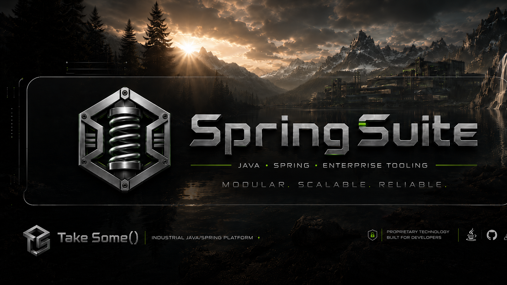

# SpringSuite
<p align="center">
  
</p>

SpringSuite is the first Java Gradle Spring control-plane skeleton for the NOESIS / NorthStar operator workflow.

Current scope:

- Spring Boot application shell.
- Operator logging API and in-memory log stream.
- Cloudflared quick tunnel lifecycle API.
- Rolling application logs under `logs/`.

Future scope:

- Tool registry.
- Task runtime.
- Database-backed run history and project memory.
- Safe filesystem workspace policies.

## Run

```powershell
gradle :suite-app:bootRun
```

Application starts on:

```text
http://localhost:8090
```

## Enable cloudflared manually

Cloudflared is disabled by default. Start the app, then call:

```powershell
Invoke-RestMethod -Method Post http://localhost:8090/api/tunnel/cloudflared/start
```

Or enable autostart:

```powershell
$env:SUITE_CLOUDFLARED_ENABLED="true"
$env:SUITE_CLOUDFLARED_AUTO_START="true"
gradle :suite-app:bootRun
```

Cloudflared command used by default:

```text
cloudflared tunnel --url http://localhost:8090 --no-autoupdate
```

## APIs

```text
GET  /api/system/status
GET  /api/operator/logs
POST /api/operator/logs
GET  /api/operator/logs/stream
GET  /api/tunnel/cloudflared/status
POST /api/tunnel/cloudflared/start
POST /api/tunnel/cloudflared/stop
POST /api/tunnel/cloudflared/restart
GET  /api/tunnel/cloudflared/logs
GET  /actuator/health
```

## OpenAI integration

SpringSuite includes the `suite-openai` module for server-side OpenAI access. It keeps secrets outside Java code and resolves bearer credentials in this order when `suite.openai.auth.mode=auto`:

1. OpenAI Workload Identity Federation, when `OPENAI_EXTERNAL_OIDC_JWT`, `OPENAI_IDENTITY_PROVIDER_ID`, and `OPENAI_SERVICE_ACCOUNT_ID` are available.
2. `OPENAI_ACCESS_TOKEN`, for externally managed short-lived access tokens.
3. `OPENAI_API_KEY`, used as the bearer credential fallback.

Runtime endpoints:

- `GET /api/openai/status` — credential source, fingerprint, cache path, expiry and refresh window; no secret is returned.
- `POST /api/openai/auth/refresh` — forces workload-identity token refresh and updates the app-token cache.
- `POST /api/openai/responses` — sends a Responses API request through the configured token provider.

Console commands:

- `openai status`
- `openai setup` — opens the local browser binding page.
- `openai refresh`
- `openai ask <prompt>`

Browser setup:

- `GET /openai/setup` — local-only HTML page for first OpenAI credential binding.
- `POST /api/openai/link/api-key` — stores a local API key credential on the server side.
- `POST /api/openai/link/unlink` — removes the local credential.

The workload-identity token cache defaults to `authority/openai/app_access_token.json` under the Suite runtime root. The browser-linked local credential defaults to `authority/openai/local_credentials.json`.

## Provider-agnostic AI service

SpringSuite 0.2 introduces a provider-agnostic AI facade. Core contracts live in `suite-core` under `com.takesome.springsuite.core.ai`; runtime routing lives in `suite-ai`; provider implementations live in modules.

Key endpoints:

- `GET /api/ai/providers` — list registered AI providers.
- `GET /api/ai/status?provider=<id>` — inspect provider credentials without revealing secrets.
- `POST /api/ai/chat` — send a provider-agnostic chat request.

Console commands:

- `ai providers`
- `ai default`
- `ai status [provider]`
- `ai ask [--provider id] [--model id] <prompt>`
- `ai setup <provider>`

Built-in providers:

- `openai` — module-backed adapter over `suite-openai` and the OpenAI Responses API.
- `zai` — configurable OpenAI Chat Completions compatible adapter for GLM, defaulting to `glm-5.2` and `ZAI_API_KEY`.
- `local-openai-compatible` — disabled template for local/self-hosted OpenAI-compatible endpoints such as vLLM, SGLang, LM Studio or Ollama-compatible servers.

The older `/api/openai/*` endpoints and `openai` console command remain available as compatibility surfaces.

## Desktop helper AI suite

SpringSuite now includes `suite-desktop-helper`, a local-first assistant layer for desktop context, form hints and operator-reviewed form filling. It is deliberately assistive by default: it can read structured context, generate hints and produce a fill plan, but desktop write actions remain disabled unless explicitly enabled and approved.

Desktop helper surfaces:

- `active-window` — active app, title, URL and focused-control context through `suite-desktop-capture` or compatible sidecar.
- `screen-text` — visible text / OCR / selected text as read-only context.
- `browser-form` — structured form fields from a browser extension, accessibility bridge or DOM adapter.
- `clipboard` — disabled by default; can be enabled separately for read/write clipboard workflows.
- `keyboard-mouse` — disabled by default; reserved for future approved typing, hotkeys and pointer execution.

Runtime endpoints:

- `GET /api/desktop-helper/status` — module status, enabled surfaces, policy flags and capture-tool availability.
- `GET /api/desktop-helper/schema` — integration schema for sidecars, browser extensions and desktop drivers.
- `POST /api/desktop-helper/context/capture` — run the configured desktop capture sidecar through toolbelt and store the latest snapshot.
- `POST /api/desktop-helper/context/ingest` — ingest raw sidecar/browser/accessibility JSON and normalize it into `DesktopFocusContext`.
- `GET /api/desktop-helper/context/latest` — return the last captured or ingested snapshot, even when stale.
- `GET /api/desktop-helper/context/current` — return the latest snapshot only when its TTL is still valid.
- `DELETE /api/desktop-helper/context/latest` — clear the in-memory desktop snapshot cache.
- `POST /api/desktop-helper/context/analyze` — analyze `DesktopFocusContext` and report risk, field counts and next actions.
- `POST /api/desktop-helper/hints` — generate validation, safety and focused-field hints.
- `POST /api/desktop-helper/form-fill/plan` — map safe profile/constraint values to detected form fields and return an approval-aware plan.

Console commands:

- `desktop-helper status`
- `desktop-helper schema`
- `desktop-helper surfaces`
- `desktop-helper endpoints`

Default policy:

```yaml
suite:
  desktop-helper:
    enabled: true
    mode: assistive
    require-approval-for-write-actions: true
    allow-desktop-capture: true
    allow-clipboard-read: false
    allow-clipboard-write: false
    allow-form-fill-planning: true
    allow-autofill-execution: false
    allow-submit-actions: false
    approval-token-ttl-seconds: 120
    max-approval-token-ttl-seconds: 900
```

Example form-fill planning request:

```json
{
  "userGoal": "Help fill this contact form safely.",
  "locale": "en-US",
  "profile": {
    "fullName": "Example User",
    "email": "user@example.com",
    "company": "Example Labs"
  },
  "context": {
    "platform": "windows",
    "activeApplication": "chrome.exe",
    "activeWindowTitle": "Contact form",
    "url": "https://example.test/contact",
    "form": {
      "id": "contact",
      "name": "Contact",
      "fields": [
        { "id": "name", "label": "Full name", "type": "text", "required": true },
        { "id": "email", "label": "Email", "type": "email", "required": true },
        { "id": "company", "label": "Company", "type": "text" },
        { "id": "password", "label": "Password", "type": "password", "required": true }
      ]
    }
  }
}
```

The response returns field-level actions such as `fill`, `select`, `check`, `ask`, `review` or `leave`. Sensitive fields are review-only by default and raw sensitive values are not returned in generated plans.

## Desktop bridge v1

Desktop bridge v1 closes the loop between external desktop capture tools and the AI helper. It accepts both raw sidecar output and precise browser/accessibility payloads, then normalizes them into the canonical `DesktopFocusContext` used by analyze/hints/form-fill planning.

Bridge flow:

```text
suite-desktop-capture / browser bridge / accessibility bridge
        ↓
raw desktop JSON
        ↓
DesktopContextNormalizer
        ↓
DesktopFocusContext
        ↓
DesktopSnapshotCache
        ↓
analyze / hints / form-fill-plan
```

Capture through the configured sidecar:

```powershell
Invoke-RestMethod -Method Post http://localhost:8090/api/desktop-helper/context/capture `
  -ContentType "application/json" `
  -Body '{ "args": ["capture"], "store": true }'
```

Ingest a browser/accessibility snapshot directly:

```json
{
  "source": "browser-extension",
  "store": true,
  "snapshot": {
    "platform": "windows",
    "activeWindow": {
      "process": "chrome.exe",
      "title": "Contact form",
      "url": "https://example.test/contact"
    },
    "focusedElement": {
      "role": "textbox",
      "name": "Email",
      "automationId": "email"
    },
    "screenText": {
      "selectedText": "",
      "visibleText": "Full name Email Company Message Submit"
    },
    "form": {
      "id": "contact",
      "name": "Contact",
      "fields": [
        { "id": "name", "label": "Full name", "name": "name", "type": "text", "required": true },
        { "id": "email", "label": "Email", "name": "email", "type": "email", "required": true, "focused": true },
        { "id": "password", "label": "Password", "name": "password", "type": "password", "required": true, "valuePresent": true }
      ]
    }
  }
}
```

The normalizer redacts sensitive field values during ingestion. For sensitive fields, bridges should send `valuePresent`, `valueLength` or non-secret metadata instead of raw values.

## Desktop approval layer v1

The approval layer is the safety gateway between form-fill planning and any future real desktop executor. It does not type, click, paste or submit. It issues short-lived approval tokens and performs dry-run validation against the latest fresh snapshot.

Approval flow:

```text
DesktopFormFillPlan / explicit DesktopApprovedAction[]
        ↓
POST /api/desktop-helper/approvals
        ↓
DesktopApprovalToken bound to snapshotId + action list + TTL
        ↓
POST /api/desktop-helper/actions/dry-run
        ↓
DesktopActionDryRunResult with guard status and execution preview
```

Issue an approval token from explicit actions:

```json
{
  "snapshotId": "snapshot-id-from-context-current",
  "purpose": "review contact-form fill",
  "operator": "local-operator",
  "scopes": ["desktop.actions.dry-run"],
  "ttlSeconds": 120,
  "actions": [
    {
      "actionId": "fill:email",
      "action": "fill",
      "targetFieldId": "email",
      "label": "Email",
      "value": "user@example.com",
      "write": true,
      "sensitive": false,
      "submit": false,
      "reason": "Candidate value came from reviewed profile data."
    }
  ]
}
```

Dry-run the token:

```json
{
  "approvalToken": "token-id-from-approval-response",
  "snapshotId": "snapshot-id-from-context-current",
  "markTokenUsed": false
}
```

Dry-run guards check:

- token exists, is not expired and is not used;
- token includes `desktop.actions.dry-run` or `desktop.actions.execute` scope;
- current snapshot is fresh and matches the requested/token snapshot id;
- target form fields still exist in the current snapshot;
- sensitive actions were explicitly allowed and contain no hidden automatic secret write;
- submit actions are blocked by default.

The next milestone after this layer is a dry-run-backed execution stub, then a real executor only after guards, audit trail and explicit operator approval are all stable.
